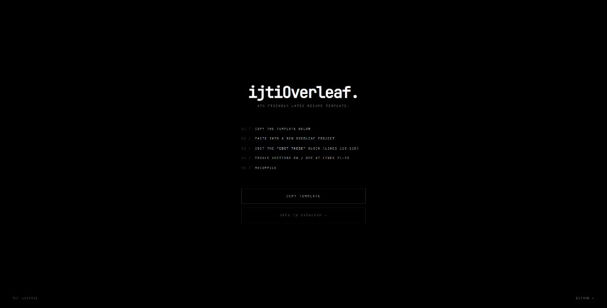

<div align="center">

<h1>ijtiOverleaf.</h1>
<h3><em>ATS-friendly LaTeX resume template for Overleaf.</em></h3>

<p>
  <a href="https://ijtioverleaf.vercel.app"></a>
  <a href="https://www.overleaf.com/docs?snip_uri=https%3A%2F%2Fraw.githubusercontent.com%2FIjtihed%2FijtiOverleaf%2Fmain%2Fmain.tex"></a>
  <a href="https://github.com/Ijtihed/ijtiOverleaf/blob/main/LICENSE"></a>
  <a href="https://github.com/Ijtihed/ijtiOverleaf"></a>
</p>

<br />



</div>

> Clean, hand-made resume template. Copy into Overleaf, fill in your info, toggle sections on or off, compile. That's it.

---

## Usage

1. Go to the [live page](https://ijtioverleaf.vercel.app) and click **Copy Template**
2. Paste into a new [Overleaf](https://overleaf.com) project as `main.tex`
3. Edit the **`EDIT THESE`** block (lines 110–118):

```latex
\newcommand{\FullName}{Your Name}
\newcommand{\PortfolioText}{portfolio: yoursite.dev}
\newcommand{\PortfolioUrl}{https://yoursite.dev}
\newcommand{\Phone}{+1 (555) 000-0000}
\newcommand{\Email}{you@email.com}
\newcommand{\LinkedInText}{linkedin.com/in/you}
\newcommand{\LinkedInUrl}{https://www.linkedin.com/in/you/}
\newcommand{\GitHubText}{github.com/you}
\newcommand{\GitHubUrl}{https://github.com/you}
```

4. Toggle sections on or off (lines 21–23):

```latex
\setboolean{includeProjects}{true}   % Projects section
\setboolean{includeSRS}{true}        % Selected Research / Publications
\setboolean{includeRA}{true}         % Research Assistant experience block
```

5. Replace example content with your own, click **Recompile**

---

## Notes

- **"Runaway argument" error** — you accidentally commented out a closing `}` with `%`
- To add a new entry, copy an existing block and change the text
- All packages are available on Overleaf by default — no extra setup needed

## License

[MIT](LICENSE)

---

<div align="center">
<sub>Built by <a href="https://github.com/Ijtihed">Ijtihed</a></sub>
</div>
